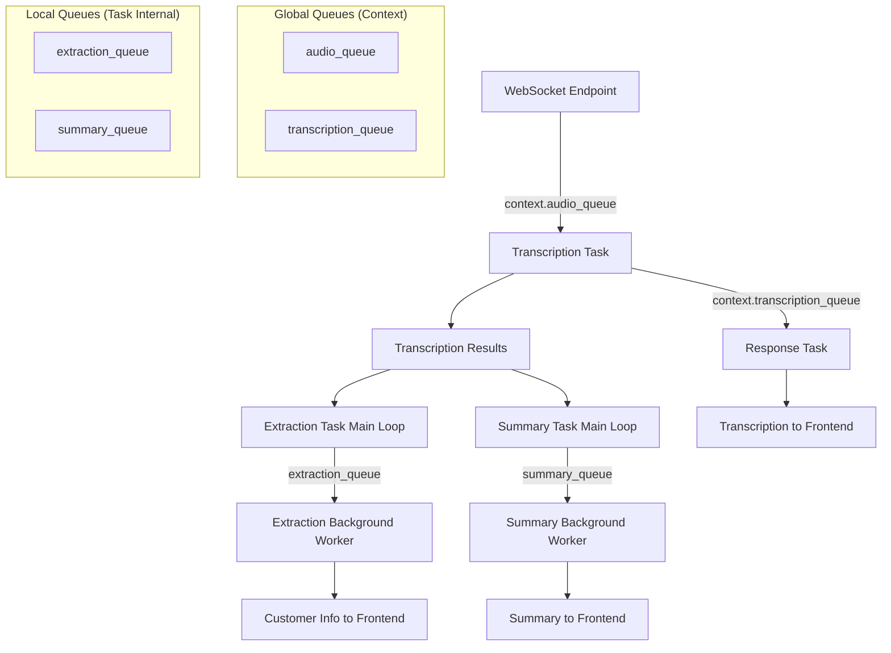

# Queue Architecture Documentation

## What is asyncio.Queue?

**asyncio.Queue** is an async-safe FIFO (First In, First Out) data structure that allows different async tasks to communicate without blocking each other.

### Basic Operations

```python
import asyncio

# Create queue
queue = asyncio.Queue()

# Producer: Add items (non-blocking)
await queue.put("item1")
await queue.put("item2")

# Consumer: Get items (blocks until available)
item = await queue.get()  # Gets "item1"
item = await queue.get()  # Gets "item2"
item = await queue.get()  # Blocks forever (queue empty)
```

### Key Characteristics

- **FIFO**: First item in is first item out
- **Thread-safe**: Multiple async tasks can use same queue
- **Blocking**: `.get()` waits until item is available
- **Buffering**: Stores items when producer is faster than consumer
- **Backpressure**: Natural flow control between fast/slow components

## Queue Patterns in Our Backend

### Pattern 1: Global Queues (Cross-Task Communication)

**Location**: `Context` class in `base.py`

```python
class Context:
    def __init__(self):
        self.audio_queue = Queue()         # WebSocket → Transcription
        self.transcription_queue = Queue() # Transcription → Response
```

**Purpose**: Connect different tasks together

### Pattern 2: Local Queues (Internal Task Optimization)

**Location**: Inside individual task workers

```python
# extraction_task.py
async def run_worker(self, ws: WebSocket, context: Context):
    extraction_queue = asyncio.Queue()  # Main loop → Background worker
    
# summary_task.py
async def run_worker(self, ws: WebSocket, context: Context):
    summary_queue = asyncio.Queue()     # Main loop → Background worker
```

**Purpose**: Prevent LLM calls from blocking main loops

## Complete System Architecture

### ASCII Diagram

```
┌─────────────────────────────────────────────────────────────────────────────────┐
│                           WEBSOCKET ENDPOINT                                    │
│                                                                                 │
│  data = await websocket.receive_bytes()                                         │
│  await context.audio_queue.put(data)  ←── GLOBAL QUEUE                         │
└─────────────────────────────────────────────────────────────────────────────────┘
                                    │
                                    │ context.audio_queue
                                    ▼
┌─────────────────────────────────────────────────────────────────────────────────┐
│                         TRANSCRIPTION TASK                                      │
│                                                                                 │
│  ┌─────────────────────────────────────────────────────────────────────────┐   │
│  │                        MAIN LOOP                                        │   │
│  │                                                                         │   │
│  │  audio_bytes = await context.audio_queue.get()  ←── GLOBAL QUEUE       │   │
│  │  await self.process(audio_bytes, context)                               │   │
│  │                                                                         │   │
│  └─────────────────────────────────────────────────────────────────────────┘   │
│                                    │                                            │
│                                    │ Puts results in                            │
│                                    ▼                                            │
│                    context.transcription_queue.put()  ←── GLOBAL QUEUE         │
└─────────────────────────────────────────────────────────────────────────────────┘
                                    │
                                    │ context.transcription_queue
                                    ▼
┌─────────────────────────────────────────────────────────────────────────────────┐
│                           RESPONSE TASK                                         │
│                                                                                 │
│  record_data = await context.transcription_queue.get()  ←── GLOBAL QUEUE       │
│  await ws.send_text(json.dumps(response))                                      │
└─────────────────────────────────────────────────────────────────────────────────┘

┌─────────────────────────────────────────────────────────────────────────────────┐
│                         EXTRACTION TASK                                         │
│                                                                                 │
│  ┌─────────────────────────────────────────────────────────────────────────┐   │
│  │                        MAIN LOOP                                        │   │
│  │                                                                         │   │
│  │  if len(context.transcription_texts[index:]) >= 5:                     │   │
│  │      text = "".join(context.transcription_texts[index:index+5])        │   │
│  │      await extraction_queue.put(text)  ←── LOCAL QUEUE                 │   │
│  │                                                                         │   │
│  └─────────────────────────────────────────────────────────────────────────┘   │
│                                    │                                            │
│                                    │ extraction_queue (LOCAL)                   │
│                                    ▼                                            │
│  ┌─────────────────────────────────────────────────────────────────────────┐   │
│  │                    BACKGROUND WORKER                                    │   │
│  │                                                                         │   │
│  │  text = await extraction_queue.get()  ←── LOCAL QUEUE                  │   │
│  │  info = await run_in_executor(self.extract_information, text)          │   │
│  │  await ws.send_text(json.dumps({"type": "information", ...}))          │   │
│  │                                                                         │   │
│  └─────────────────────────────────────────────────────────────────────────┘   │
└─────────────────────────────────────────────────────────────────────────────────┘

┌─────────────────────────────────────────────────────────────────────────────────┐
│                           SUMMARY TASK                                          │
│                                                                                 │
│  ┌─────────────────────────────────────────────────────────────────────────┐   │
│  │                        MAIN LOOP                                        │   │
│  │                                                                         │   │
│  │  if current_count - last_processed_count >= 5:                         │   │
│  │      await summary_queue.put({"summaries": ..., "texts": ...})         │   │
│  │                                            ↑                           │   │
│  │                                       LOCAL QUEUE                      │   │
│  └─────────────────────────────────────────────────────────────────────────┘   │
│                                    │                                            │
│                                    │ summary_queue (LOCAL)                      │
│                                    ▼                                            │
│  ┌─────────────────────────────────────────────────────────────────────────┐   │
│  │                    BACKGROUND WORKER                                    │   │
│  │                                                                         │   │
│  │  data = await summary_queue.get()  ←── LOCAL QUEUE                     │   │
│  │  summary = await run_in_executor(self.summarize, ...)                  │   │
│  │  await ws.send_text(json.dumps({"type": "summary", ...}))              │   │
│  │                                                                         │   │
│  └─────────────────────────────────────────────────────────────────────────┘   │
└─────────────────────────────────────────────────────────────────────────────────┘
```

### Mermaid Diagram



## Queue Usage Examples

### Example 1: Fast Producer, Slow Consumer

```python
# Producer adds 10 items quickly
for i in range(10):
    await queue.put(f"item_{i}")
print("All items queued!")  # Happens immediately

# Consumer processes slowly
while True:
    item = await queue.get()  # Gets items one by one
    await asyncio.sleep(2)    # 2 seconds per item
    print(f"Processed {item}")
```

**Result**: Queue buffers all 10 items, consumer processes them sequentially.

### Example 2: Background Processing Pattern

```python
async def main_loop():
    work_queue = asyncio.Queue()
    
    # Background worker
    async def worker():
        while True:
            task = await work_queue.get()  # Wait for work
            result = await slow_operation(task)  # Do slow work
            await send_result(result)
    
    # Start worker
    asyncio.create_task(worker())
    
    # Main loop stays responsive
    while True:
        if should_do_work():
            await work_queue.put(work_data)  # Queue work
        await asyncio.sleep(0.1)  # Stay responsive
```

## Benefits of Queue Architecture

### 1. **Decoupling**
- Components don't wait for each other
- Each works at its own pace
- Easy to modify individual components

### 2. **Buffering**
- Handles speed mismatches between components
- Prevents data loss during processing spikes
- Natural backpressure management

### 3. **Responsiveness**
- UI never blocks on slow operations
- Real-time updates as results become available
- Smooth user experience

### 4. **Scalability**
- Easy to add more workers
- Can handle burst traffic
- Graceful degradation under load

## Implementation Guidelines

### When to Use Global Queues
- **Cross-task communication**
- **Main data pipeline**
- **Shared between multiple components**

### When to Use Local Queues
- **Internal task optimization**
- **Preventing blocking operations**
- **Background processing within single task**

### Best Practices
1. **Always use `await`** with `.put()` and `.get()`
2. **Handle exceptions** in queue workers
3. **Use `asyncio.create_task()`** for background workers
4. **Cancel tasks properly** on shutdown
5. **Monitor queue sizes** for debugging

## Troubleshooting

### Common Issues
- **Queue grows infinitely**: Consumer too slow, add more workers
- **Tasks hang on `.get()`**: No producer, check queue flow
- **Memory usage high**: Queue buffering too much, add backpressure
- **Results out of order**: Using multiple consumers, ensure ordering

### Debug Tips
```python
# Check queue size
print(f"Queue size: {queue.qsize()}")

# Add logging to track flow
await queue.put(item)
print(f"Queued: {item}")

item = await queue.get()
print(f"Processing: {item}")
```